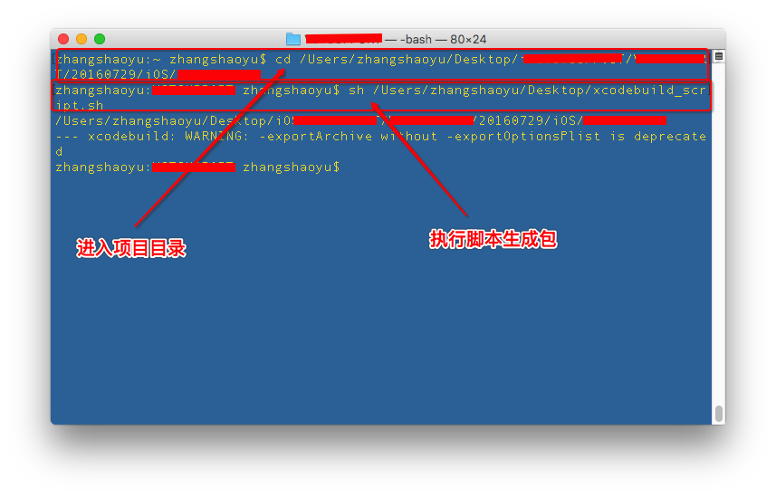
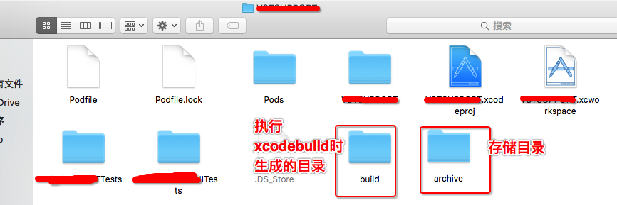
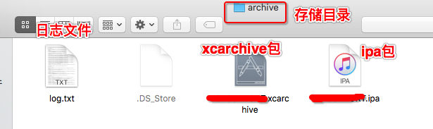

# SYIPAGeneratedScript
make a ipa by script——使用脚本生成ipa包

# 脚本功能说明
# 在终端，使用xcodebuild脚本进行自动生成ipa，及脚本自动上传蒲公英平台
 * 方法1、xcodebuild
 * 方法2、xcodebuild + xctool
 * 方法3、xcodubuild + xcrun
 
# 另外也可以使用 jenkins 进行自动化构建。jenkins的使用也离不开脚本的配置。

# 使用步骤（注意：xcodebuild命令执行打包时，必须在项目目录下进行）：
 * 1 目录配置（打包上传目录、项目目录）
 * 2 项目配置（版本、名称、证书、描述文件UUID、描述文件、archive保存目录、ipa保存目录）
 * 3 删除旧文件
 * 4 清除旧项目
 * 5 生成archive
 * 6 生成ipa
 * 7 上传ipa到蒲公英

# 使用注意事项（根据实际情况修改参数）
 * 1 修改路径：upload_path路径；target_path路径；蒲公英上传文件路径。
 * 2 项目配置：tagert_name项目名称；codecodeSignIdentity证书；provision_UUID描述文件UUID；provisoning_profile描述文件名称。
 * 3 蒲公英上传：user_key；api_key。

# 技巧
 * 1 获取证书名称：Launchpad->其他->钥匙串访问->选择证书->鼠标右击->显示简介->细节->常用名称->复制
 * 2 获取描述文件UUID：打开Xcode->菜单栏->Preferences->Accounts->Apple IDs->帐号->show Details->Provisioning Profiles->选择项目中使用的描述文件->鼠标右击->show in Finder
 * 3 获取target/schemes：终端->cd 项目目录->进入项目目录后，执行命令"xcodebuild -list"

# plist配置文件说明（四个参数：method、teamID、uploadSymbols、uploadBitcode）
 * 测试用时，仅使用method-development/ad-hoc、uploadBitcode-NO
 * plist文件配置说明
  * 1 提交App Store的plist文件参数设置，如：AppStoreExportOptions.plist：method＝app-store，uploadBitcode＝YES，uploadSymbols＝YES
  * 2 内测的plist文件参数设置，如：TestExportOptions.plist：method＝ad-hoc，compileBitcode＝NO
  * 3 method的可选值为：app-store, package, ad-hoc, enterprise, development, developer-id
 * The Export Options Plist
 * method: (String) The method of distribution, which can be set as any of the following:
  * app-store
  * enterprise
  * ad-hoc
  * development
  * teamID: (String) The development program team identifier.
  * uploadSymbols: (Boolean) Option to include symbols in the generated ipa file.
  * uploadBitcode: (Boolean) Option to include Bitcode.

# xcodebuild：https://developer.apple.com/legacy/library/documentation/Darwin/Reference/ManPages/man1/xcodebuild.1.html
# xcrun：
# xctool：https://github.com/facebook/xctool
# 蒲公英：https://www.pgyer.com

# 脚本执行方法：终端-sh 脚本文件-回车。
#终端操作执行脚本文件：

#项目目录：

#脚本执行生成包目录及文件：

# 待完善
* 20180116
  * 目录分类

* 20171011
  * OS X软件开发

* 20171011前
  * 1 svn脚本update下载最新代码
  * 2 shell脚本修改项目信息（如：app名称）
  * 3 shell脚本创建及修改文件（如：plist文件及其内容）
  * ……

